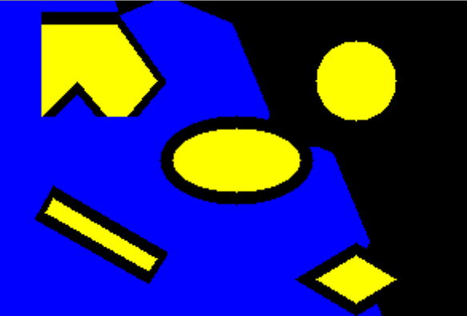

Author Information
--

    Govind Ajith Kumar
    University of Maryland
    Masters Robotics
    govindak@umd.edu
    
    Rajeshwar NS
    Masters Robotics
    University of Maryland
    College Park
    Maryland
    20740 USA
    
Youtube Video Link:
--
https://www.youtube.com/watch?v=m8FAkKLAhUQ&feature=emb_logo

Solutions:
--

 

 
 
 
.png)

  Language: Python 3.7.x

Libraries implemented:
--

    numpy :: for matrices and other associated numerical calculations. 
    math :: for all mathematical operations
    heapq :: for priority queue
    time :: for measuring the time
    cv2 :: for image related operations (OpenCV 4.xx)
    pygame :: For animations

This README file is for two codes
The programme solves the obstacle map based on the Dijkstras Algorithm. 

Code 1 : Solves the obstacle map based on the Dijkstras Algorithm For Point Robot

The following inputs are required by the user:

x_start= the x coordinate of the start
y_start= y coordinate of the start
x_goal= x coordinate of the goal
y_goal= y coordinate of the goal

Code 2 : Solves the obstacle map based on the Dijkstras Algorithm For Rigid Robot

The following inputs are required by the user:

x_start= the x coordinate of the start
y_start= y coordinate of the start
x_goal= x coordinate of the goal
y_goal= y coordinate of the goal
Radius = Radius of the robot
Clearence = Clearance of the robot

Both codes takes about 5 minutes to solve (subject to the leptop specifications), and then output 
the following:

> After Reaching the goal, the backtracking will commence.

> Once the backtracking is complete the following sets of outputs are given out.

> Image of the obstacles

> Pygame animation of the robot visiting all the nodes. (Note: The animation is tuned for full screen. Hence, it will open
a new screen altogether. PLEASE DO NOT CLOSE IT IN BETWEEN, as that will cause the kernel to die, if 
run in Jupyter Notebook and will require the whole code to be run again. The animation will stop itself, 
when the goal is reached.)

> The path backtracked by the code.

